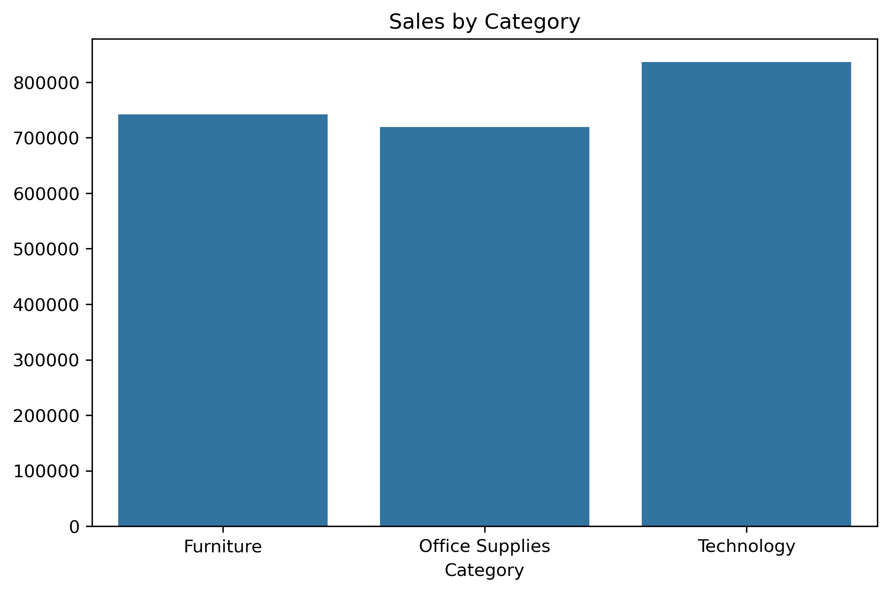
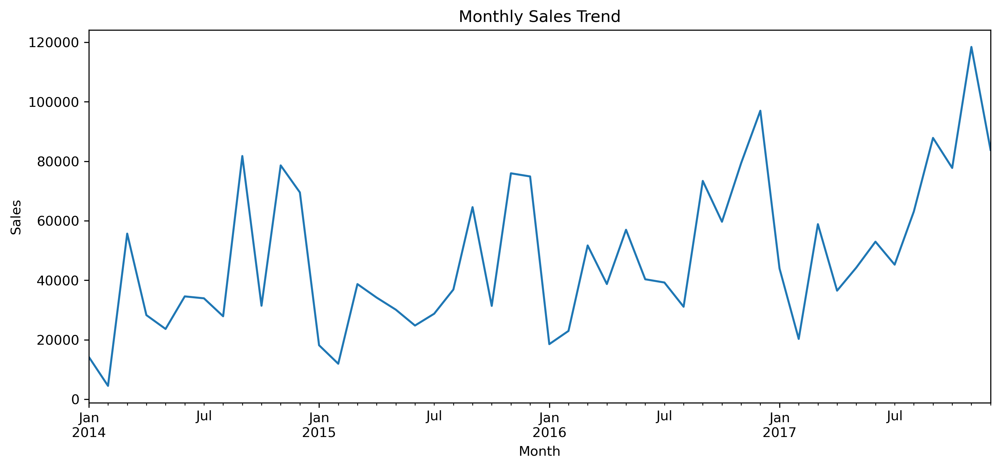

# Ecommerce-Sales-Analysis

## 📌 Project Overview
This project analyzes an E-commerce sales dataset to uncover business insights.  
The analysis was done using **Python (Pandas, Matplotlib, Seaborn)** and **SQL**.  

## 📂 Dataset
- Source: Kaggle [Sample Superstore Dataset](https://www.kaggle.com/datasets/vivek468/superstore-dataset-final)  
- Rows: ~10,000  
- Columns: Order Date, Sales, Profit, Category, Region, etc.  

## 🔍 Analysis Performed
- Data cleaning (missing values, date format)  
- Total sales & profit  
- Sales by category and region  
- Monthly sales trends  
- Top products by sales  

## 📊 Visualizations
- Bar chart of sales by category  
- Line chart showing monthly sales trend  

### 📷 Sample Output

### Sales by Category
  
*Bar chart showing sales by category*

### Monthly Sales Trend
  
*Line chart showing monthly sales trend*

## 🛠️ Tools Used
- Python (Pandas, Matplotlib, Seaborn)  
- SQL (SQLite for queries)  
- Jupyter Notebook  

## 🚀 How to Run
```bash
git clone https://github.com/praveends255/ecommerce-sales-analysis.git
cd ecommerce-sales-analysis
pip install -r requirements.txt
jupyter notebook analysis.ipynb
```


## 👩‍💻 Author

**Praveen Kumar**  
[GitHub Profile](https://github.com/praveends255)  
[LinkedIn Profile](https://www.linkedin.com/in/praveen-kumar-b3b136364/)